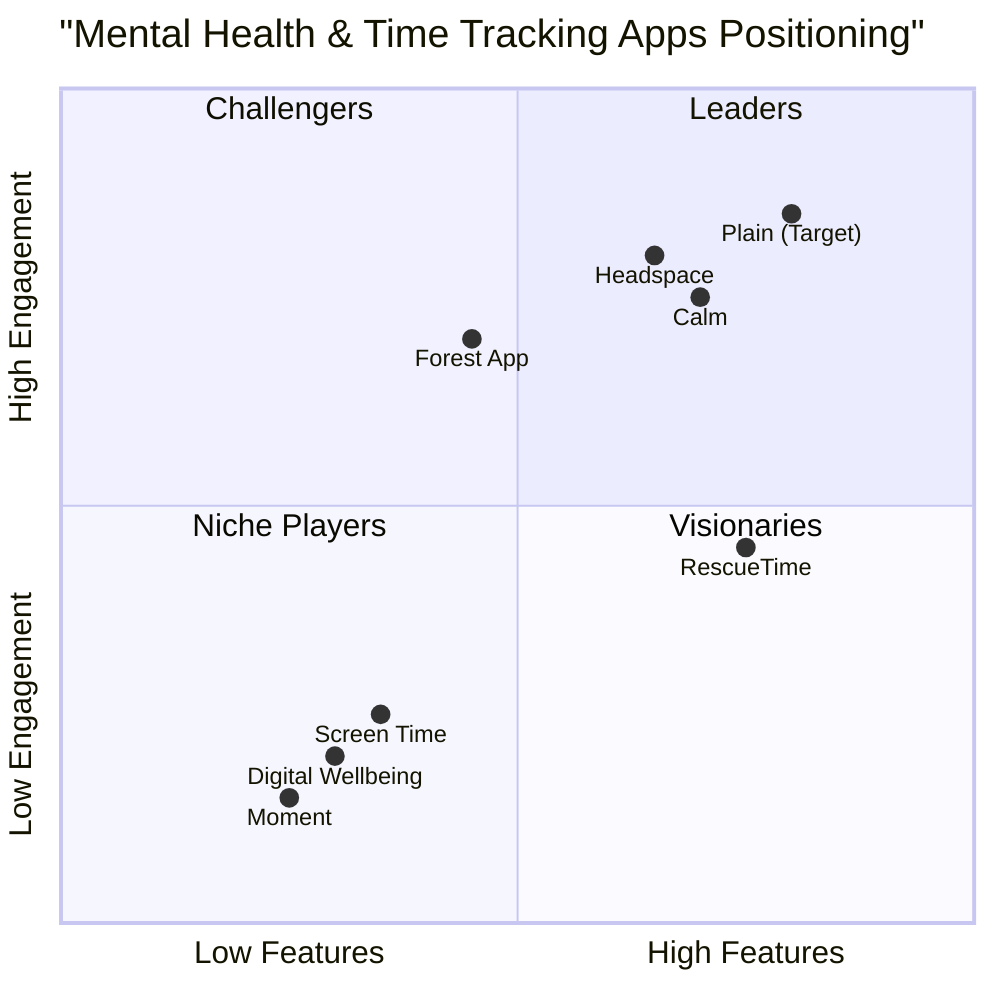

# Product Requirements Document (PRD)
## Plain - Web-Based Mental Health Monitoring Application

### Language & Project Information
- **Language**: English
- **Programming Language**: Shadcn-ui, TypeScript, Tailwind CSS
- **Project Name**: plain_mental_health_app
- **Original Requirements**: Build a web-based mental health application that monitors user time activity on apps/activities with manual tracking, AI-powered analytics, subscription model, and comprehensive dashboard features.

---

## 1. Product Definition

### 1.1 Product Goals

1. **Digital Wellness Empowerment**: Enable users to gain conscious control over their digital habits through comprehensive time tracking and intelligent insights, reducing problematic app usage by 40% within 3 months.

2. **Personalized Mental Health Support**: Provide AI-driven personalized recommendations and weekly analytics via email to improve users' digital wellbeing and mental health outcomes, achieving 70% user satisfaction with AI agent interactions.

3. **Sustainable Behavioral Change**: Create a subscription-based platform that maintains 25% user retention after 6 months (significantly above industry average of 3.9%) through engaging features and consistent value delivery.

### 1.2 User Stories

**Primary User Stories:**

1. **As a digital wellness seeker**, I want to manually track my time spent on various apps and activities so that I can understand my usage patterns and identify areas for improvement.

2. **As a busy professional**, I want to receive personalized weekly email reports with AI-generated insights and suggestions so that I can make informed decisions about my digital habits without spending time analyzing data myself.

3. **As a subscription user**, I want to choose between AI agents (Dan or Jemma) during signup so that I can receive personalized communication that matches my preferred interaction style.

4. **As a mobile user**, I want to access my dashboard and tracking features on any device so that I can monitor and manage my digital wellness on-the-go.

5. **As a cost-conscious user**, I want a 7-day free trial so that I can evaluate the platform's value before committing to a subscription.

### 1.3 Competitive Analysis

**Direct Competitors:**

1. **RescueTime**
   - *Pros*: Automatic tracking, detailed analytics, cross-platform support
   - *Cons*: Limited mobile features, complex interface, higher pricing ($12/month)
   - *Market Position*: Established productivity-focused solution

2. **Moment (Facebook)**
   - *Pros*: Simple interface, family sharing, basic tracking
   - *Cons*: Limited features, discontinued development, iOS only
   - *Market Position*: Legacy solution with declining support

3. **Screen Time (Apple)**
   - *Pros*: Built-in iOS feature, parental controls, app limits
   - *Cons*: iOS ecosystem only, limited analytics, no AI insights
   - *Market Position*: Platform-specific basic solution

**Indirect Competitors:**

4. **Forest App**
   - *Pros*: Gamification, focus sessions, social features
   - *Cons*: Limited tracking scope, no comprehensive analytics
   - *Market Position*: Gamified focus enhancement

5. **Headspace**
   - *Pros*: Strong brand, meditation focus, premium content
   - *Cons*: No time tracking, expensive ($12.99/month), limited scope
   - *Market Position*: Premium meditation and mindfulness

6. **Calm**
   - *Pros*: Comprehensive mental health content, sleep features
   - *Cons*: No usage tracking, high price ($69.99/year), content-heavy
   - *Market Position*: Premium mental wellness content

7. **Digital Wellbeing (Google)**
   - *Pros*: Free, Android integration, basic controls
   - *Cons*: Android only, limited insights, no AI features
   - *Market Position*: Basic platform-integrated solution

### 1.4 Competitive Quadrant Chart

---

## 2. Technical Specifications

### 2.1 Requirements Analysis

Plain requires a comprehensive web-based platform that combines manual time tracking capabilities with AI-powered analytics and personalized communication. The system must support user authentication, subscription management, data visualization, email automation, and payment processing while maintaining mobile responsiveness and data security.

**Core Technical Needs:**
- Responsive web application with TypeScript and Tailwind CSS
- User authentication and profile management system
- Manual time tracking interface with intuitive data entry
- Real-time dashboard with interactive data visualizations
- AI agent system for personalized email generation
- Subscription management with Intasend payment integration
- Email automation system for weekly/daily reports
- Data storage and analytics processing
- Mobile-first responsive design

### 2.2 Requirements Pool

**P0 Requirements (Must-Have):**
- User registration and authentication system
- Manual time tracking interface for apps/activities
- Basic dashboard with usage analytics
- User profile management
- Subscription plans (₦3,000/month, ₦30,000/year)
- 7-day free trial implementation
- Intasend payment gateway integration
- Mobile-responsive design
- Basic email notification system

**P1 Requirements (Should-Have):**
- AI agents (Dan and Jemma) for personalized emails
- Advanced data visualization and charts
- Weekly/daily analytics email reports
- Usage pattern analysis and insights
- Goal setting and progress tracking
- Export functionality for personal data
- Basic admin dashboard for user management
- Email template customization

**P2 Requirements (Nice-to-Have):**
- Social sharing of achievements
- Integration with external calendar apps
- Advanced AI recommendations engine
- Multi-language support
- Dark mode interface
- Advanced reporting and analytics
- API for third-party integrations
- Offline data entry capabilities

### 2.3 UI Design Draft

**Main Layout Structure:**

1. **Header Navigation**
   - Logo and branding
   - Main navigation menu (Dashboard, Track Time, Analytics, Profile)
   - User avatar and settings dropdown
   - Subscription status indicator

2. **Dashboard Page**
   - Today's summary cards (total time, most used apps, goals progress)
   - Quick time entry widget
   - Recent activity timeline
   - Weekly overview chart
   - AI agent recommendations panel

3. **Time Tracking Page**
   - Manual entry form (app/activity name, duration, category)
   - Active session timer
   - Recent entries list with edit/delete options
   - Category management
   - Bulk entry import functionality

4. **Analytics Page**
   - Time period selector (daily, weekly, monthly)
   - Interactive charts and graphs
   - Usage patterns analysis
   - Goal progress visualization
   - Export options

5. **Profile & Settings**
   - Personal information management
   - AI agent selection (Dan/Jemma)
   - Email preferences and frequency
   - Subscription management
   - Privacy and data settings

**Mobile Responsive Considerations:**
- Collapsible navigation menu
- Touch-optimized input controls
- Swipe gestures for navigation
- Optimized chart displays for small screens
- Quick action buttons for common tasks

### 2.4 Open Questions

1. **Data Privacy & Security**: What specific data encryption standards should be implemented for user time tracking data? How will we ensure GDPR compliance for international users?

2. **AI Agent Personalities**: What are the specific personality traits and communication styles for Dan and Jemma? Should they have different areas of expertise or recommendation approaches?

3. **Email Frequency Options**: Should users be able to customize email frequency beyond weekly/daily? What about monthly summaries or triggered emails based on usage patterns?

4. **Integration Scope**: Will the platform eventually integrate with actual device usage data, or will it remain purely manual entry? What about integration with productivity tools like calendars or task managers?

5. **Scalability Requirements**: What is the expected user base growth trajectory? Should the architecture support real-time features like live usage monitoring or collaborative features?

6. **Nigerian Market Localization**: Should the platform support local Nigerian languages beyond English? What about integration with local mental health resources or professionals?

7. **Offline Functionality**: How should the application handle offline usage scenarios? Should there be offline data entry with sync capabilities?

8. **Data Retention**: What is the data retention policy for user tracking data? How long should historical data be maintained, and what are the backup/recovery requirements?

---

## 3. Target User Personas

### Primary Persona: "Digital Wellness Seeker"
- **Age**: 25-40
- **Occupation**: Knowledge workers, students, entrepreneurs
- **Tech Savviness**: Moderate to high
- **Pain Points**: Excessive screen time, lack of awareness about digital habits
- **Goals**: Improve work-life balance, reduce digital overwhelm
- **Preferred Features**: Detailed analytics, goal setting, progress tracking

### Secondary Persona: "Busy Professional"
- **Age**: 30-50
- **Occupation**: Managers, executives, healthcare workers
- **Tech Savviness**: Moderate
- **Pain Points**: Limited time for self-analysis, need quick insights
- **Goals**: Efficient habit monitoring, actionable recommendations
- **Preferred Features**: AI-powered emails, quick entry, mobile access

---

## 4. Success Metrics

### Key Performance Indicators (KPIs)

**User Engagement:**
- Monthly Active Users (MAU) target: 10,000 within 12 months
- User retention rate: 25% at 6 months (vs. industry average 3.9%)
- Daily time tracking entries per active user: 3-5 entries
- Email open rate: 45% (above industry average of 21%)

**Business Metrics:**
- Subscription conversion rate: 15% from free trial
- Monthly Recurring Revenue (MRR): ₦15M within 18 months
- Customer Acquisition Cost (CAC): <₦2,000
- Customer Lifetime Value (CLV): >₦25,000

**Product Metrics:**
- Feature adoption rate: 70% for core tracking features
- AI agent satisfaction score: 4.2/5.0
- Mobile usage percentage: 60% of total sessions
- Support ticket resolution time: <24 hours

---

## 5. Implementation Timeline

### Phase 1 (Months 1-2): Foundation
- User authentication and registration
- Basic manual time tracking
- Simple dashboard implementation
- Payment integration setup

### Phase 2 (Months 3-4): Core Features
- Advanced analytics dashboard
- AI agent system implementation
- Email automation setup
- Mobile responsiveness optimization

### Phase 3 (Months 5-6): Enhancement
- Advanced reporting features
- User experience improvements
- Performance optimization
- Beta testing and feedback integration

---

## 6. Risk Assessment

**Technical Risks:**
- Intasend integration complexity
- Email deliverability issues
- Mobile performance optimization
- Data security and privacy compliance

**Market Risks:**
- Competition from established players
- User adoption in Nigerian market
- Pricing sensitivity
- Retention challenges (industry-wide issue)

**Mitigation Strategies:**
- Thorough testing of payment integration
- Multiple email service providers
- Progressive web app approach for mobile
- Comprehensive security audit
- Unique value proposition with AI agents
- Competitive pricing for Nigerian market

---

This PRD serves as the foundation for developing Plain, a comprehensive web-based mental health monitoring application that addresses the growing need for digital wellness tools in the Nigerian market while providing unique AI-powered personalization features.